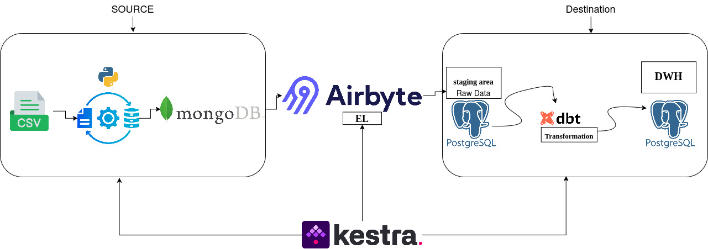
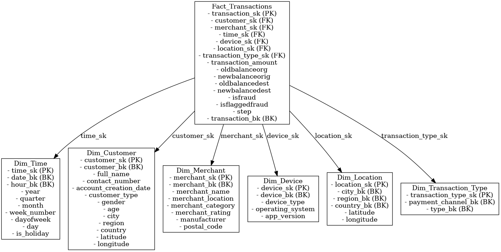

# 🚀 Fraud Detection & Transaction Risk Analysis

## 🔍 Overview
This project builds a **fraud detection & transaction risk analysis pipeline** for a **digital wallet system**.  
It leverages a **Star Schema** to structure transaction data efficiently for analytical processing.  

The ETL pipeline extracts, transforms, and loads (ETL) transaction data while ensuring **high performance & integrity**.  



## 📊 Data Model – Star Schema
The project follows a **Star Schema** for optimized storage & analytics.



### 🏦 **Fact Table: `Fact_Transactions`**
> Stores core transaction details & links to multiple dimensions.

| Column | Type | Description |
|---------|------|-------------|
| `transaction_sk` | PK | Unique transaction key |
| `customer_sk` | FK | Links to customers |
| `merchant_sk` | FK | Links to merchants |
| `time_sk` | FK | Links to time table |
| `device_sk` | FK | Links to device info |
| `location_sk` | FK | Geographical location |
| `transaction_amount` | NUMERIC | Amount transacted |
| `isfraud` | BOOLEAN | Fraud flag |
| `isflaggedfraud` | BOOLEAN | Flagged fraud status |

### 🏷️ **Dimension Tables**
#### 📆 `Dim_Time` – Stores transaction timestamps  
- `time_sk` (PK) 🗝️  
- `date_bk`, `hour_bk`, `month`, `dayofweek`, `is_holiday`  

#### 👤 `Dim_Customer` – Customer details  
- `customer_sk` (PK) 🗝️  
- `full_name`, `contact_number`, `age`, `city`, `country`  

#### 🏬 `Dim_Merchant` – Merchant information  
- `merchant_sk` (PK) 🗝️  
- `merchant_name`, `category`, `rating`, `location`  

#### 📱 `Dim_Device` – Device & OS details  
- `device_sk` (PK) 🗝️  
- `device_type`, `operating_system`, `app_version`  

#### 📍 `Dim_Location` – Geographical data  
- `location_sk` (PK) 🗝️  
- `city`, `region`, `latitude`, `longitude`  

#### 💳 `Dim_Transaction_Type` – Payment type details  
- `transaction_type_sk` (PK) 🗝️  
- `payment_channel_bk`, `type_bk`  

---

## ⚙️ **Data Pipeline Architecture**  
Follows a structured **ELT (Extract, Load, Transform) pipeline**.  

### 🛠️ **Tech Stack**  
✅ **Python & Pandas** – Data processing & transformation  
✅ **MongoDB** – NoSQL database for raw storage  
✅ **Airbyte** – Extracts & loads data into PostgreSQL  
✅ **PostgreSQL** – Data warehouse for analytics  
✅ **dbt** – Data modeling & transformations  
✅ **Kestra** – Workflow orchestration  

### 🔄 **Data Flow**  
1️⃣ **CSV → JSON & MongoDB** 📥  
   - Convert raw transactions into JSON  
   - Insert into **MongoDB**  

2️⃣ **MongoDB → PostgreSQL (Staging)** 🛢️  
   - **Airbyte** extracts & loads raw data  

3️⃣ **PostgreSQL → Data Warehouse** 🎯  
   - **dbt** transforms data into a **star schema**  

4️⃣ **Orchestration with Kestra** 🤖  
   - Automates the full pipeline  

---

## 🚀 **Running the Pipeline**  
### ✅ **Prerequisites**  
Install the required tools:  
```bash
pip install pandas pymongo
# Install MongoDB, PostgreSQL, Airbyte, dbt, and Kestra
```  

### 🔧 **Execution Steps**  
1️⃣ **Load Data into MongoDB**  
```bash
python convert_to_json_connect_mongo.ipynb
```  
2️⃣ **Run Airbyte to transfer data from MongoDB to PostgreSQL**  
3️⃣ **Execute dbt transformations**  
```bash
dbt run
```  
4️⃣ **Use Kestra for orchestration**  

---  

## 🚀 **Future Enhancements**  
✅ Implement **incremental loading** for optimized performance  
✅ Enhance **data validation & cleansing** before insertion  
✅ Integrate **real-time fraud detection** with streaming tech  

---  
**📌 Author:** Abdulrhman Khalifa  

🔗 LinkedIn: [https://www.linkedin.com/in/abdulrahman-m-khalifa/](#)  

---  

🎯 **Built for fraud prevention. Powered by data.** 💡  
